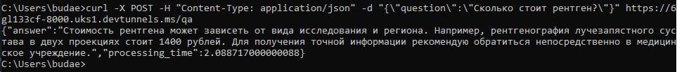

### Для доступа через интернет:

https://6gl133cf-8000.uks1.devtunnels.ms + эндпоинт

https://6gl133cf-8000.uks1.devtunnels.ms/api - базовый эндпоинт

---
### Телеграмм
    
[FiveChromoClinicBot](https://t.me/FiveChromoClinicBot)

---

### Пример запроса

curl -X POST -H "Content-Type: application/json" -d "{\"question\":\"Сколько стоит рентген?\"}" https://6gl133cf-8000.uks1.devtunnels.ms/qa

---

### Локальный запуск:
* в каталоге \bot 
    
    запустить main.py - api бота
* в каталоге \mesengers
  
    запустить telegram_aiohttp.py - оброботчик сообщений из ТГ
* в каталоге \feedback_service
  
    запустить main.py - api сервиса обработки отзывов

* ну и БДшка локальная нужна, создать можно при помощи feedback_service\script.sql
